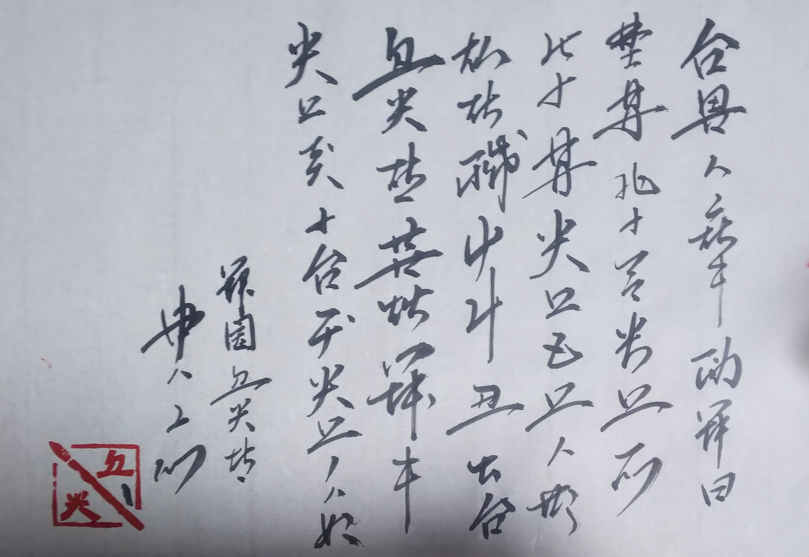
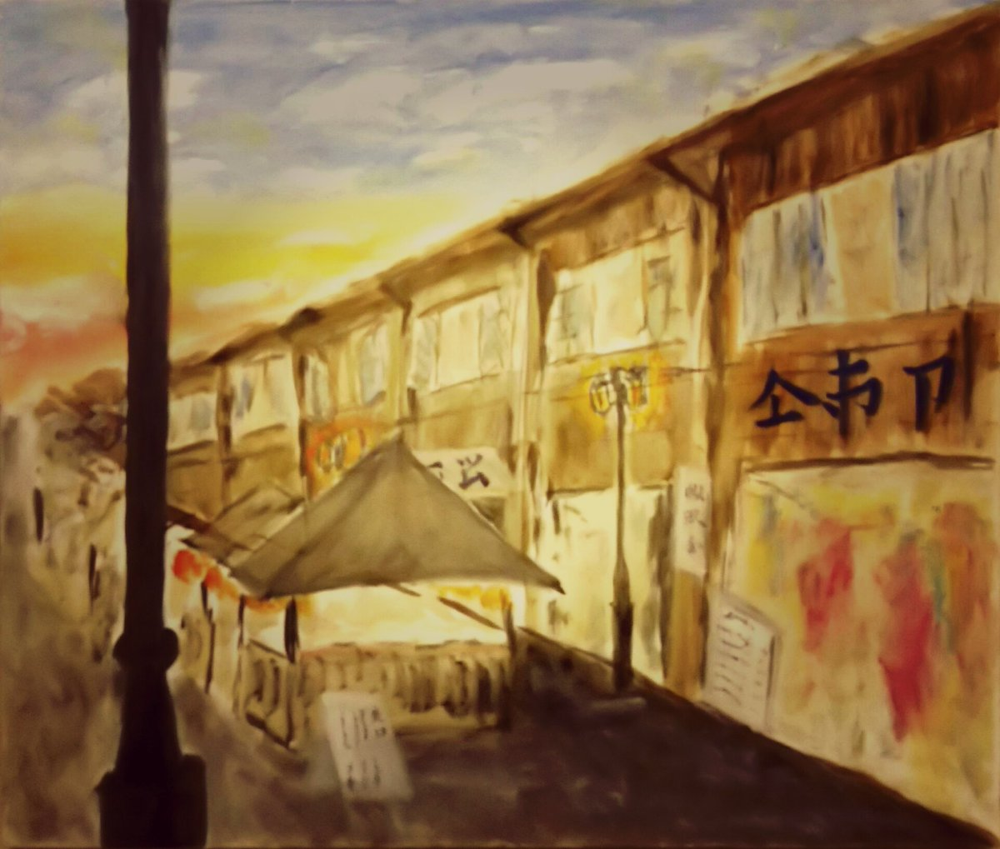

# linzklar-recognition

## What this is 
Linzklar (pronounced LINTS-claah), or Lanermic logogram, is a logographic writing system used mainly in [Faikleone](https://wikirlevip.miraheze.org/wiki/Faikleone), a [conworld](https://en.wikibooks.org/wiki/Conworld) the authors of this repository are building. 






This repository currently contains the dataset of hand-written linzklar (written by the builders of the conworld through a [Web app](https://github.com/jurliyuuri/linzi-recognition)), with which we aim to implement a handwriting linzklar input system in the future.

## Data format

[/data](https://github.com/jurliyuuri/linzklar-recognition/tree/master/data) contains all the raw data, where each JSON file is either an array of `{ "character": (annotation), "data" : (array of array of {x: number, y: number}) }`, or `{ "character": (annotation), "data" : (array of array of {x: number, y: number}), initialDotCaptured: true}`. Each array of coordinates corresponds to a stroke; an array of strokes makes up a character. Due to an oversight, for the first 30,126 characters the initial dot of every single stroke is absent from the data, and such files are marked with the lack of `initialDotCaptured: true`.

[/data_images/svg](https://github.com/jurliyuuri/linzklar-recognition/tree/master/data_images/svg) contains all the raw data converted into svg images. `initial_dot_captured` contains the >20,000 characters whose initial dot of every stroke is properly recorderd. `initial_dot_omitted` is made up of >50,000 characters stripped off of their initial dots (unintentionally for the first 30,126; intentionally for the remaining data). `initial_dot_captured_or_augmented` is a folder containing all the images in `initial_dot_captured`, as well as the first 30,126 characters with each of the missing initial dot inferred (by a simple linear interporation) from the remaining dots.

`/data_images/svg` is generated by converting from `/data` using `/converter`. Provided that you have [cargo installed](https://doc.rust-lang.org/stable/cargo/getting-started/installation.html), all you need to do is

```
$ cd converter
$ cargo run --release
```

[/data_images/png](https://github.com/jurliyuuri/linzklar-recognition/tree/master/data_images/png) is the same as `/data_images/svg`, except that it is converted to png with [mogrify](https://imagemagick.org/script/mogrify.php).

## Shuffle through the dataset
[Shuffle through the dataset](http://jurliyuuri.com/linzklar-recognition/random.html).

## これはなに
燐字データセットのデータ集
 
cf. [thanks.txt](https://github.com/jurliyuuri/linzi-recognition/blob/master/thanks.txt)
